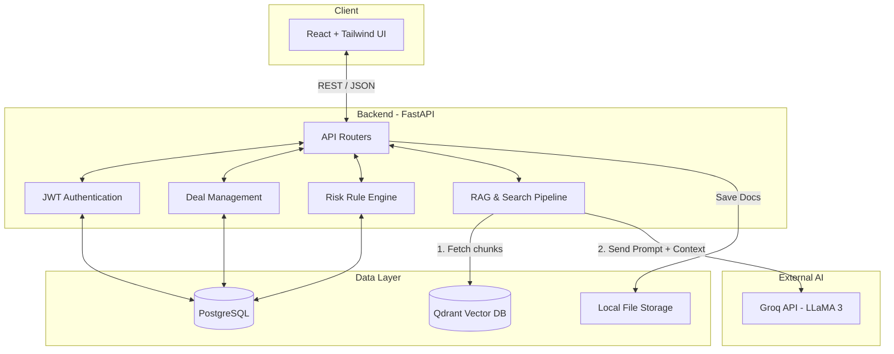

# Veridion AI - Interview Preparation Guide

This document is designed to give you a deep, technical understanding of the **Veridion AI** project, how the technologies interact, and exactly how the AI/RAG pipelines function. This will help you ace any technical interview questions regarding system design, technology choices, and architectural workflows.

---

## 1. High-Level System Architecture

Veridion AI is a modern full-stack web application with an AI-native backend. 

### Core Components
1. **Frontend (Client)**: React.js SPA (Single Page Application) built with Vite and Tailwind CSS.
2. **Backend (API)**: Python-based FastAPI server.
3. **Relational Database**: PostgreSQL (for structured relational data like Users, Deals, Roles).
4. **Vector Database**: Qdrant (for unstructured data, specifically document embeddings for semantic search).
5. **AI Providers**: Groq API (for LLM inference) and a local Embedding Model (for generating vector representations of text).

### Mermaid System Design Diagram

---

## 2. Technology Stack & "Why We Chose It"

### Frontend
- **React.js (with TypeScript)**: Provides a component-based architecture making complex state management (like deal workspaces) easy to maintain. TypeScript ensures type safety, reducing runtime bugs.
- **Tailwind CSS**: A utility-first CSS framework. We chose it for rapid prototyping and to easily implement the complex, premium "Glassmorphism" and dark-mode aesthetics without writing thousands of lines of custom CSS.
- **Lucide React**: For clean, modern SVG icons that match the premium aesthetic.
- **Vite**: A modern build tool that is significantly faster than Create React App (Webpack), providing instant Hot Module Replacement (HMR).

### Backend
- **FastAPI (Python)**: Extremely fast, natively async, and automatically generates Swagger documentation based on Pydantic schemas. It’s the industry standard for modern AI/ML backends.
- **SQLAlchemy & Alembic**: SQLAlchemy is our ORM (Object Relational Mapper) used to interact with PostgreSQL using Python classes instead of raw SQL. Alembic tracks our database schema changes (migrations).
- **PostgreSQL**: A robust, ACID-compliant relational database. Perfect for ensuring data integrity across Users, Companies, Deals, and complex Role-Based Access Control (RBAC) structures.
- **Qdrant**: An open-source Vector Database. It is extremely fast, scales well, and is optimized for storing high-dimensional vectors and performing nearest-neighbor semantic searches (critical for RAG).
- **Groq API**: We use Groq to host LLaMA-3. Groq uses specialized LPU (Language Processing Unit) hardware, making inference exponentially faster than standard GPU-hosted models. This provides near-instant AI answers to the user.

---

## 3. Core Workflows Explained

### A. Authentication & RBAC (Role-Based Access Control)
1. **Login**: User submits email/password. FastAPI verifies against the hashed password in Postgres.
2. **Token Generation**: If valid, FastAPI generates a signed JWT (JSON Web Token) and returns it.
3. **Authorization**: The frontend stores the JWT in `localStorage` and attaches it as a `Bearer` token to every subsequent API request. 
4. **RBAC**: The backend extracts the user's role from the token (`seller_admin`, `buyer_lawyer`, etc.). Endpoints (like `delete_deal`) use dependency injection to verify the user has the required role before executing.

### B. The Document Upload Pipeline
When a seller uploads a document (PDF/DOCX):
1. The file is saved to local storage (`storage/documents/`).
2. The backend records metadata (filename, deal ID, uploader) in PostgreSQL.
3. **Extraction**: The backend extracts raw text from the file (using `pypdf` or `docx2txt`).
4. **Chunking & Embedding**: The text is split into smaller "chunks". Each chunk is passed through a local embedding model to generate a 512-dimensional vector.
5. **Vector Storage**: These vectors, along with the raw text payload, are inserted into Qdrant, tagged with the `deal_id` and `document_id`.

---

## 4. The RAG Pipeline (Retrieval-Augmented Generation)

This is the most critical technical part of the platform. Here is how "Ask the AI" works behind the scenes:

**1. Query Embedding**
When the user asks *"What are the termination clauses in this deal?"*, we cannot send thousands of pages of documents to the LLM (it would exceed the context window and be incredibly slow/expensive).
Instead, we take the user's query and pass it through the *exact same* embedding model used during document upload. This converts the query into a 512-dimensional vector.

**2. Semantic Retrieval (Vector Search)**
We query Qdrant: *"Find the top 5 document chunks in this specific deal whose vectors are mathematically closest (Cosine Similarity) to my query vector."*
Qdrant instantly returns the 5 most relevant paragraphs from the uploaded documents.

**3. Prompt Engineering (Augmentation)**
We construct a strict prompt for the Groq LLM:
> *"You are a legal AI assistant. Answer the user's question using ONLY the following context. If the answer is not in the context, say 'I don't know'. Cite the document names.*
> *Context:*
> *- [Doc A]: 'Either party may terminate upon 30 days notice...'*
> *- [Doc B]: 'Termination incurs a $50k fee...'*
> *Question: What are the termination clauses?"*

**4. Generation**
Groq processes this augmented prompt and streams back the synthesized, source-backed answer to the frontend.

---

## 5. The Automated Risk Engine

While RAG is great for *answering* questions, due diligence also requires *proactive* risk flagging.

**How it works:**
1. A Seller Admin defines a "Risk Rule" (e.g., "Flag any mention of *non-compete*").
2. This rule is stored in PostgreSQL as a Regular Expression (Regex) pattern.
3. When a new document is uploaded, a background task pulls all active Risk Rules for that deal.
4. It iterates over the extracted text of the document, running the Regex patterns.
5. If a pattern matches (or fails to match, if inverted), a "Risk Flag" is generated and saved to Postgres.
6. The frontend queries these flags to populate the beautiful "Risk Summary" dashboard.

---

## 6. Project Structure Overview

- `backend/app/api/routers/`: The FastAPI endpoints (Controllers). Where HTTP requests arrive.
- `backend/app/services/`: The business logic. Where database operations and AI logic are orchestrated.
- `backend/app/database/models.py`: The SQLAlchemy schema definitions (Tables).
- `backend/app/ai/`: Contains the Groq integration (`provider.py`), the RAG/Search logic (`search_service.py`), and the Embedding logic (`embeddings.py`).
- `frontend/src/pages/`: The top-level React components (Views) mapped to routes (e.g., `DealDetailPage.tsx`).
- `frontend/src/services/`: The Axios functions used to make HTTP calls to the backend API. 
