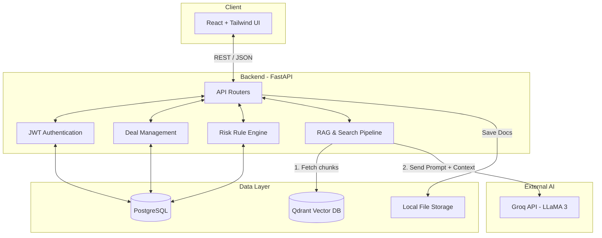

# Veridion AI

**AI-Powered Virtual Data Room for Modern Due Diligence**

> An intelligent Virtual Data Room (VDR) platform that combines secure document management, permission-aware retrieval, and AI-powered due diligence assistance to help organizations analyze complex business transactions faster for secure dealmaking. 

---
## Overview

Mergers, acquisitions, and investment decisions rely heavily on due diligence — a process where companies exchange and analyze thousands of confidential documents before a deal is finalized.
Traditional VDRs provide document sharing, but the actual review process remains slow and manual. Analysts, investors, and legal teams still spend weeks reading contracts, financial reports, compliance documents, and operational records to identify potential risks.

**Veridion AI transforms the traditional data room into an intelligent deal workspace.**
The platform enables sellers to securely share sensitive documents while allowing buyers to use AI-powered search, document intelligence, and risk analysis to accelerate due diligence decisions.

---
## Features

- **Secure Virtual Data Room** — Centralized platform for storing and managing confidential deal documents.
- **AI Due Diligence Assistant** — Ask natural language questions and receive intelligent and source-backed cited answers from deal documents.
- **AI-Powered Deal Insights** — Converts large volumes of documents into actionable business intelligence.
- **Risk Intelligence Engine** — Detects potential deal risks, liabilities, and hidden concerns across documents.
- **Retrieval-Augmented Generation (RAG)** — Combines vector search with LLMs for accurate, context-aware responses.
- **Permission-Aware Retrieval** — Ensures AI responses are generated only from documents accessible to the user.
- **Buyer Workspace** — Enables investors to analyze documents, discover risks, and accelerate decision-making.
- **Seller Workspace** — Allows companies to securely share information while maintaining control.
- **Role-Based Access Control** — Separate Buyer and Seller permissions to ensure controlled information sharing.
- **Document Upload & Management** — Upload, organize, and manage business documents securely.
- **Vector-Based Knowledge Storage** — Stores document embeddings for efficient similarity search and retrieval.

## Technology Stack

**Frontend**
- React + TypeScript
- Tailwind CSS
- Vite

**Backend**
- Python 3.12 + FastAPI
- PostgreSQL (Relational Database)
- Qdrant (Vector Database for Embeddings)
- groq API (LLM)
- SQLAlchemy + Alembic
- LangChain for RAG

---
## System Design



---
## Project Structure

```
├── backend/
│   ├── app/
│   │   ├── ai/            # Groq LLM and Embeddings integrations
│   │   ├── api/routers/   # FastAPI route definitions
│   │   ├── database/      # SQLAlchemy models & session
│   │   ├── schemas/       # Pydantic validation schemas
│   │   └── services/      # Core business logic
│   ├── alembic/           # Database migration scripts
│   └── requirements.txt
├── frontend/
│   ├── src/
│   │   ├── components/    # Reusable UI components
│   │   ├── pages/         # Application views (Dashboard, DealWorkspace, etc.)
│   │   ├── services/      # API integration
│   │   └── hooks/         # Custom React hooks
│   ├── index.css          # Tailwind configuration & global styles
│   └── package.json
├── storage/               # Local volume mounts for uploaded files
└── docker-compose.yml     # Infrastructure orchestration
```

---
## Get Started

The easiest way to run Veridion AI locally is using Docker Compose. This will spin up the Backend, PostgreSQL database, pgAdmin, and Qdrant vector store.

### 1. Prerequisites
- Docker & Docker Compose
- Node.js (v18+) for the frontend
- A groq API Key

### 2. Environment Variables
Create a `.env` file in the root directory based on the `.env.example` structure.
You MUST provide your groq API key.

### 3. Start the Backend Infrastructure
Run the following command from the root of the project:
```bash
docker compose up --build -d
```
This will start:
- **Backend API**: `http://localhost:8000`
- **Postgres Database**: `localhost:5432`
- **pgAdmin**: `http://localhost:5050`
- **Qdrant**: `http://localhost:6333`

*Note: On first run, Alembic will automatically run migrations to create all database tables.*

### 4. Start the Frontend Application
In a new terminal, navigate to the `frontend` folder, install dependencies, and start the Vite dev server:
```bash
cd frontend
npm install
npm run dev
```
The application will be available at `http://localhost:5173`.

